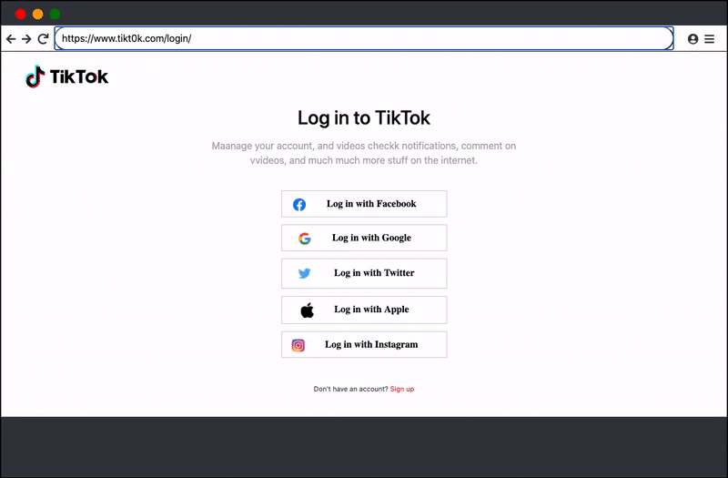

# CSAF 2020 - Phishing Website Rough Draft 

## "Under The Hood"

The attack by phishing websites has increased during covid-19. It is important that everyone, from organizations to individuals becomes aware of it in order to prevent thousands of financial losses and more importantly identity theft. 

Purpose of this project is to teach people the dangers of phishing. Showing exactly how user credentials are logged and then manipulated by attackers.

------------------------------

## Technologies

- Client-side
  * HTML/CSS
- Server-side
  * PHP
  
  
------------------------------

## Phishing Website "Under The Hood" Example

Display a phishing website (spoofed website) that looks identical to a popular website. Sign up normally without identifying if website is fake. While inputting fake credentials, show how login credentials are being logged and display how easy it is to control user information. Creating fake website is easy and setting one up that harvests user credentials can be dangerous and prone to identity theft. 

>>>>>>> ab6ed810f6dbd6c425b8b8dba09851a96466a95a

</img> 

## Interactive Phishing Demo

Want to learn more about identifying a phishing website? Click on the following [Phishing Demo](https://cfalucho.github.io/CSAF2020-PhishingSite/).

